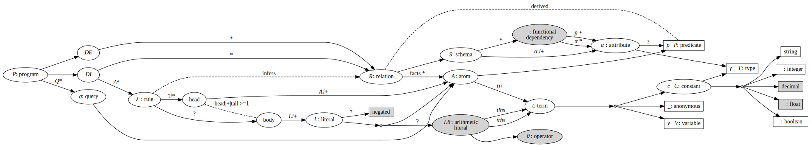

# Basic Concepts

_This section is non-normative._

The following graph is an informal representation of the DATALOG-TEXT grammar. It represents_leaf values_ (constants, variables, …) in rectangles and _composite values_ as ellipses. Additionally, where a composite is defined as $\small A \oplus B$ a small filled diamond shape represents the exclusive or relationship. Finally, some edges in the graph are labeled with "`*`", "`+`", and "`?`" which are the common cardinality notation used in regular expressions and BNF notation.

Abstract Graph View (click to expand)

**Notes**

1. The edge between _rule_ and _head_ has the label "`?/*`" as it has differing cardinality under $\small\text{Datalog}$, $\small\text{Datalog}^{\lor}$, and $\small\text{Datalog}^{\Leftarrow}$.
2. The edge between _literal_ and _negated?_ is labeled as "`?`" as it is necessary under $\small\text{Datalog}^{\lnot}$ but not under $\small\text{Datalog}$.
3. The edge from the choice between _literal_ and _comparison_ is labeled as "`?`" as it is necessary under
   $\small\text{Datalog}^{\theta}$ but not under $\small\text{Datalog}$.
4. The three dashed lines represent the following constraints.
   1. Between _rule_ and _relation_ to represent the fact that intensional relations are inferred from rule evaluation.
   2. Between _relation_ and _predicate_ to represent the fact that the predicate for a relation may be derived from the predicate of the _atoms_ within it (or vice versa).
   3. Between _head_ and _body_ to represent the fact that while both are optional for a _rule_, one or other must be present.

## Brief Summary of Concepts

_This section is non-normative._

### Program

A $\small\text{Datalog}$ program $\small P$ is a tuple comprising the extensional _database_, EDB, or  $\small D_{E}$, the intensional _database_, IDB, or  $\small D_{I}$, and a set of **[queries](#queries)** $\small Q$.

$$\small P=\(D_{E}, D_{I}, Q\)$$

The extensional database is a set of (extensional-) **[relations](#relations)**.

The intensional database is a set of **[rules](#rules)**, $\small\Lambda$, for constructing additional (intensional-) **[relations](#relations)**.

Relations $\small R$ and rules $\small\lambda$ are built from a language $\small \mathcal{L}$,

$$\small \mathcal{L}=\( \mathcal{C},\mathcal{P},\mathcal{V},\Gamma\)$$

* $\small \mathcal{C}$ -- the finite sets of symbols for all constant values; e.g. `hello`, `"hi"`
  `123`,
* $\small \mathcal{P}$ -- predicates, the finite set of alphanumeric character strings that begin with a
  lowercase character; e.g. `human`, `size`, `a`,
* $\small \mathcal{V}$ -- variables, the finite set of alphanumeric character strings that begin with an
  uppercase character; e.g. `X`, `A`, `Var`.
* $\small \Gamma$ -- a finite set of data **[types](#types)** -- introduced by the language $\small\text{Datalog}^{\Gamma}$.

### Relations

A relation is a tuple comprising a unique label $\small \mathcal{p}$, a **[schema](#schema)** $\small S$, and a _set_ of **[facts](#facts)** $\small F\$.

$$R = (\mathcal{p}, S, F)$$

Relation labels are _predicates_ $\mathcal{p}\in\mathcal{P}$.

### Schema

A relation's schema $\small S$ is a tuple that describes the attributes $\small\(\alpha_1,\ldots,\alpha_j\)$ that make up the relation. Each attribute is a tuple of type and optional label, $\small\alpha_i=\(\gamma_i, \mathcal{p}_i^?\)$ where attribute types are taken from a set of types $\small\Gamma$ such that $\small\gamma_i\in\Gamma$ and $\small \mathcal{p}_i^?\in\mathcal{P}$.

$$\small S = \(\alpha_1,\ldots,\small \small \alpha_j\)$$

$$\small \alpha = (\gamma, \mathcal{p}^?\)$$

$$\small \forall \alpha \in S\(\gamma_{\alpha}\in\Gamma \land \mathcal{p}^?_{\alpha}\in\mathcal{P}\)$$

A relation's schema in $\small\text{Datalog}^{\rightarrow}$ is extended to support **[functional dependencies](#functional-dependencies)**.

$$\small S = \(\(\alpha_1,\ldots, \alpha_j\), \lbrace \varphi_1, \ldots, \varphi_k\rbrace \)$$

### Types

Commonly Datalog supports the simple types _boolean_ $\small\mathbb{B}$, _integers_ $\small\mathbb{Z}$, and _symbols_ $\small\mathcal{K}$. General character _strings_ may also be added, $\small\mathcal{S}$.

$$\small\Gamma = \lbrace \mathbb{B}, \mathbb{Z}, \mathcal{K}, \mathcal{S} \rbrace$$

All constant values have a type in the types for the current language.

$$\small\gamma\(c\) \in \Gamma$$

### Facts

A fact is an **[atom](#atoms)** where all **[terms](#terms)** are constant values $\small t \in \mathcal{C}$, not variables. 

$$\small \forall t \in A \(t \in \mathcal{C}\)$$

### Atoms

An atom is a predicate-labeled tuple of label and **[terms](#terms)**. The atom's label $\small\mathcal{p}\in\mathcal{P}$ identifies the relation to which it belongs. 

$$\small A=\(\mathcal{p},\(t_1,\ldots,t_j\)\)$$

Each term $\small t_i$ MUST conform to the relation's schema attribute $\small \alpha_i$.

$$\small\forall i \in \[1,j\] \(\Gamma \vdash \gamma\(t_i\) : \gamma_{\alpha_i}\)$$

### Terms

A term is either a constant value $\small c\in\mathcal{C}$, or a variable $\small v\in\mathcal{V}$.

$$\small \forall t \in A \(t \in \mathcal{C} \lor t \in \mathcal{V}\)$$

### Rules

A rule takes the form `IF antecedence THEN consequence` where the consequence is the head of the rule before the material implication symbol and the antecedence is the body of the rule after the material implication symbol.

The consequence, or head, of the rule $\small\lambda\in\Lambda$ is the disjunction of atoms $\small A_1 \ldots, A_m \subseteq D_I$ and the antecedence, or body, of the rule is the conjunction of **[literals](#literals)** $\small L_1, \ldots, L_n$.

$$\lambda=\small A_1, \lor \ldots, \lor A_m \leftarrow L_1, \land \ldots, \land L_n$$

* In $\small\text{Datalog}$ only a single atom MUST be present in the head; $\small m=1$.
* In $\small\text{Datalog}^{\lor}$ one or more atoms MAY be present in the head; $\small m \geq 1$.
* In $\small\text{Datalog}^{\Leftarrow}$ a single atom MAY or MAY NOT be present in the head; $\small m \leq 1$.

### Literals

A literal is either **relation** or **[arithmetic](#arithmetic-literals)**, $\small L^{\theta}$ and may be **[negated](#negated-literals)**. Relational literals are simply an atom:

$$\small L=A \in D_E \cup D_I$$

### Negated Literals

Negated literals are present only in $\small\text{Datalog}^{\lnot}$.

A literal may be positive $\small L$ or negative $\small \lnot L$.

$$L^{\prime} = L \oplus \lnot L$$

### Arithmetic Literals

Arithmetic literals are present only in $\small\text{Datalog}^{\theta}$.

An arithmetic literal takes the form of a tuple where $\small t_{lhs}$ and $\small t_{rhs}$ are terms and $\small\theta$ is a binary comparison operation (equal, less-than, etc.).

$$\small L^{\theta} = \(t_{lhs}, \theta, t_{rhs}\)$$

$$\small L^{\theta^{\prime}} = L^{\theta} \oplus \lnot L^{\theta}$$

### Queries

A query $\small q \in Q$ is an atom which acts as a goal and returns any facts that match its terms.

$$\small q=A \in D_E \cup D_I$$

### Functional Dependencies

Functional dependencies are present only in $\small\text{Datalog}^{\rightarrow}$.

A functional dependency, $\small\varphi$, is a uniqueness constraint for a relation of the form $\small R: \alpha \longrightarrow \beta$ with the set $\small\alpha$ or determinant and the set $\small\beta$ or dependent of attributes where the attributes exist in the relation and the two sets are not equal.

$$\small\varphi = \(R, \alpha, \beta\)$$

$$\small \alpha, \beta \subseteq S_R \land \alpha\neq\beta$$

This relationship denotes that for the relation $\small R$, every valid combination of determinant values uniquely determines the value of the dependent values.

