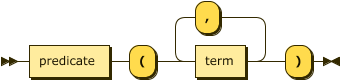
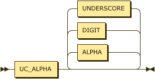

# Atoms & Terms

A term is a labeled tuple of terms and is either a **fact** or a **goal**/**sub-goal**.

In the case of a _fact_ the label identifies the relation to which it belongs and all terms must be constant values -- also termed a _ground_ atom. Facts may belong to either extensional or intensional relations.

In the case of a _goal_ it is the consequence of a rule. Its goal is satisfied if the antecedents, now termed _sub-goals_, are satisfied. 



```ebnf
atom    ::= predicate "(" term ( "," term )* ")" ;
```

## Terms

A term within an atom is simply either a constant value (string, number, boolean) or a variable.


```ebnf
term    ::= variable | constant ;
```

## Variables

Note that we explicitly separate variables into named and anonymous forms here.


```ebnf
variable
        ::= named-variable | anon-variable ;
```

A named variable is a string of characters that MUST start with a character from the Unicode category **Lu**. An anonymous variable is represented simply by a single underscore `"_"` character.



```ebnf
named-variable
        ::= UC_ALPHA ( ALPHA | DIGIT | UNDERSCORE )* ;
        
anon-variable
        ::= UNDERSCORE ;
```

## Examples

The following are all valid atoms.

```datalog
dead(julius_caesar).
emperor(julius_caesar, rome).
date(1997, 02, 26).
emperor(X, Y).
emperor(X, rome).
emperor(X, _).
```
