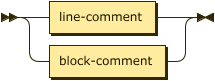
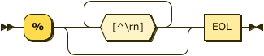

# Comments

Comments in Datalog are either 1) the `%` character and continue to the end of the line, or
2) C-style with `/*` to start and `*/` to end. These correspond to the same rules as Prolog.



```ebnf
comment ::= line-comment | block-comment ;
```



```ebnf
line-comment
        ::= "%" [^\r\n]* EOL ;
```


```ebnf
block-comment
        ::= '/*' ( [^*] | '*'+ [^*/] )* '*'* '*/' ;
```

## Example

```datalog
% Here's a comment
?- ancestor(xerces, X). % and another
?- ancestor(brooke /* and one inline */, X). % and another
```
