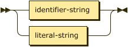
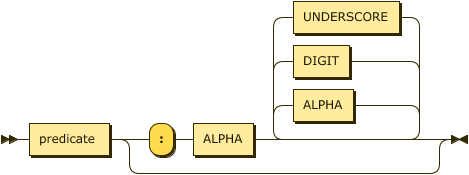
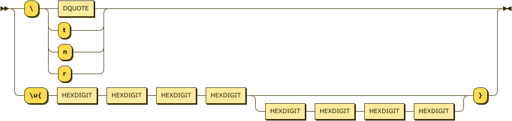
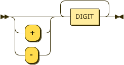
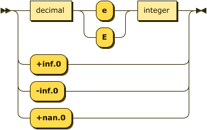
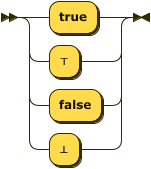

# Types & Constants

Constants are supported in three types, String, Numbers, and Boolean. Whereas some definitions of
Datalog introduce an additional Identifier type, ASDI treats these as _short strings_ that can
safely be expressed without quotes; therefore, the values `xerces` and `"xerces"` are equivalent.


```ebnf
constant
        ::= string | number | boolean ;
```

## Strings

Strings are described in both the identifier and quoted form in the `string` rule.

Strings MUST NOT contain characters from the Unicode category **Cc** (Control) except `#x09` tab, `#x0A` line feed, and `#x0D` carriage return.
Additionally, strings MUST NOT contain characters from the Unicode categories **Cf** (format), **Co** (Private Use), or **Cs** (Surrogate). 
These characters and any other non-printable characters MUST be included using the escape format: `\"`, `\t`, `\n`, `\r`, `\u{XXXX}`, or `\u{XXXXXXXX}`. 



```ebnf
string  ::= identifier-string | literal-string ;
```

An identifier string... TODO

> In some Datalog literature and implementations there is a `symbol` type...



```ebnf
identifier-string
        ::= predicate ( ":" ALPHA ( ALPHA | DIGIT | UNDERSCORE )* )? ;
```


```ebnf
literal-string
        ::= DQUOTE ( string-escape | [^#x22] )* DQUOTE ;
```



```ebnf
string-escape
        ::= "\\" ( DQUOTE | [tnr] )
        | "\u{" HEXDIGIT HEXDIGIT HEXDIGIT HEXDIGIT
              ( HEXDIGIT HEXDIGIT HEXDIGIT HEXDIGIT )? "}" ;
```

### Errors

* `ERR_INVALID_VALUE_FOR_TYPE` -- invalid characters present within a string value.

## Numbers

A conforming DATALOG-TEXT processor MUST provide the data type `integer`, and MAY provide the data types `decimal` and `float` if the feature `extended_numerics` is enabled. Any use of these types when the corresponding feature is not enabled should signal the error `ERR_FEATURE_NOT_ENABLED`.


```ebnf
number  ::= float   # Optional
        | decimal   # Optional
        | integer ; # Required
```

### Integers

While this specification does not require a specific number of bits for integer values a conforming DATALOG-TEXT processor MUST provide _at least_ 64-bit signed values. 



```ebnf
integer ::= ( "+" | "-" )? DIGIT+
```

### Fixed-Point Decimals

Fixed-Point Decimal values MUST BE a 128-bit representation of a fixed-precision decimal number. The finite set of values of type `decimal` are of the form $\small m / 10^e$, where $\small m$ is an integer such that $\small -2^{96} < m < 2^{96}$, and $\small e$ is an integer between $\small 0$ and $\small 28$ inclusive. 


```ebnf
decimal ::= integer "." DIGIT+
```

### Floating-Point

DATALOG-TEXT floating point values are patterned after the <span class="bibref inline">[XMLSCHEMA-2](x_references.md#XMLSCHEMA-2)</span> `double` type which in turn is patterned on the  IEEE double-precision 64-bit floating point type <span class="bibref inline">[IEEE754](x_references.md#IEEE754)</span>. 

> From <span class="bibref inline">[XMLSCHEMA-2](x_references.md#XMLSCHEMA-2)</span>:
> 
> _This datatype differs from that of <span class="bibref inline">[IEEE754](x_references.md#IEEE754)</span> in that there is only one NaN and only one zero. This makes the equality and ordering of values in the data space differ from that of <span class="bibref inline">[IEEE754](x_references.md#IEEE754)</span> only in that for schema purposes_ `NaN = NaN`.

The DATALOG-TEXT production uses the <span class="bibref inline">[R7RS](x_references.md#R7RS)</span> Scheme notation for infinities and not-a-number.



```ebnf
float   ::= ( decimal ( "e" | "E" ) integer )
            | "+inf.0" 
            | "-inf.0" 
            | "+nan.0" ;
```

### Errors

* `ERR_INVALID_VALUE_FOR_TYPE` -- a constant value is too large for the implementation type.

### Examples

```datalog
age(plato, 2400.0). %% ==> ERR_FEATURE_NOT_ENABLED
```

```datalog
.pragma extended_numerics.

age(plato, 2400.0).
```

## Booleans

Boolean values are represented simply as either `true` or `false`.



```ebnf
boolean ::= "true" | "false" ;
```
