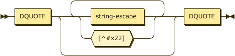

# Types & Constants

Constants are supported in three types, String, Numbers, and Boolean. Whereas some definitions of
Datalog introduce an additional Identifier type, ASDI treats these as _short strings_ that can
safely be expressed without quotes; therefore, the values `xerces` and `"xerces"` are equivalent.


```ebnf
constant
        ::= string | number | boolean ;
```

## Strings

Strings are described in both the identifier and quoted form in the `string` rule.

Strings SHOULD NOT contain characters from the Unicode categories **Cc** (Control)
with the exception of `#x09` tab, `#x0A` line feed, and `#x0D` carriage return, **Cf**
(format), **Co** (Private Use), or **Cs** (Surrogate). These characters and any other
non-printable characters SHOULD be included using the escape format: `\t`, `\n`,
`\r`, `\u{XXXX}`, or `\U{XXXXXXXX}`.


```ebnf
string  ::= identifier-string | literal-string ;
```


```ebnf
identifier-string
        ::= predicate ( ":" ALPHA ( ALPHA | DIGIT | "_" * )? ) ;
```



```ebnf
literal-string
        ::= DQUOTE ( string-escape | [^#x22] )* DQUOTE ;
```


```ebnf
string-escape
        ::= "\\" ( DQUOTE | [tnr] )
        | "\u{" HEXDIGIT HEXDIGIT HEXDIGIT HEXDIGIT
              ( HEXDIGIT HEXDIGIT HEXDIGIT HEXDIGIT )? "}" ;
```

## Numbers

Numeric values in ASDI take one of three forms, integers, decimal values, and floating point values.


```ebnf
number  ::= float | decimal | integer
```

Integer values in ASDI are signed, 64-bit values (`i64`).


```ebnf
integer ::= ( "+" | "-" )? DIGIT+
```

Decimal values in ASDI are ... TBD.


```ebnf
decimal ::= integer "." DIGIT+
```

Floating point values in ASDI are 64-bit IEEE floats (`f64`).


```ebnf
float   ::= decimal ( "e" | "E" ) integer
```

## Booleans

Boolean values may also be represented using `⊤` (down tack `\u{22a4}`) for true, and `⊥` (up tack
`\u{22a5}`) for false where this may improve readability.


```ebnf
boolean ::= ( "true"  | "⊤" ) 
        |   ( "false" | "⊥" ) ;
```
