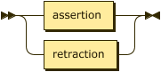
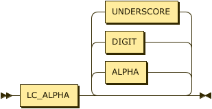

# Relations & Facts

While relations are a key aspect of the Datalog language there is no actual production for relation in the syntax. This is because the syntax instead expects a set of facts expressed and where those facts share the same label, and are _schema compatible_ they comprise a relation. Each relation has a schema that defines the number of attributes, their types, and optionally their labels. The number of attributes is often termed the _arity_ of the relation or of a fact.

> In some literature, where Datalog is analyzed from a _model theoretic_ view, the term **sort** is more often used than **schema**. In either case the meaning is equivalent. See <span class="bibref inline">[Wilfred97](x_references.md#Wilfred97)</span> and <span class="bibref inline">[AbHuVi94](x_references.md#AbHuVi94)</span>.

Facts are expressed in the form of ground [§&nbsp;Atoms](grammar_atoms.md) where all [§&nbsp;Terms](grammar_atoms.md#terms) are constant, and so they have a specific production rather than a constrained form of the `atom` rule. A predicate is the identifying label shared by a relation and its facts.



```ebnf
fact    ::= predicate ( "(" constant ( "," constant )* ")" )? "." ;
```

A predicate is a string of characters that MUST start with a character from the Unicode category **Ll**.



```ebnf
predicate
        ::= LC_ALPHA ( ALPHA | DIGIT | UNDERSCORE )* ;
```

## Errors

It is an error to add a fact that is schema incompatible with an explicitly declared extensional relation.

```datalog
.assert human(string).

human(22).
%% ==> ERR_INCONSISTENT_FACT_SCHEMA
```

It is an error to add a fact that is schema incompatible with an implicitly inferred extensional relation. In this case the first occurrence of `human` had a string value and so a relation was inferred with a single string attribute.

```datalog
human(socrates).
human(22).
%% ==> ERR_INCONSISTENT_FACT_SCHEMA
```

Some cases may not be so obvious, especially with numerics. The value `22` is inferred to be `integer`, the value `22.0` is inferred to be a `decimal`, and the value `22e1` is inferred to be a `float`. Therefore, the example below causes an error.

```datalog
human(22).   % integer
human(22.0). % decimal
%% ==> ERR_INCONSISTENT_FACT_SCHEMA
```

It is also an error to assert facts where the label identifies an intensional, rather than extensional relation.

```datalog
.assert human(string).
.infer mortal from human.

mortal(22).
%% ==> ERR_PREDICATE_NOT_AN_EXTENSIONAL_RELATION
```

In this final example the error is caused by processing in strict mode where all relations MUST be declared via processing instructions before use.

```datalog
.pragma strict.

human(socrates).
%% ==> ERR_PREDICATE_NOT_AN_EXTENSIONAL_RELATION
```

## Examples

The following demonstrates a simple fact denoting that the constant `brooke` representing some
individual is the parent of some individual represented by the constant `"Xerces"`.

```datalog
parent("Xerces", brooke).
```

In a graph program an edge can be represented as an edge with a source vertex, target vertex, and weight.

```datalog
edge(src, tgt, 100).
```
