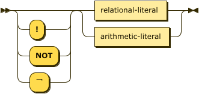
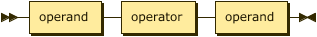
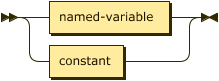
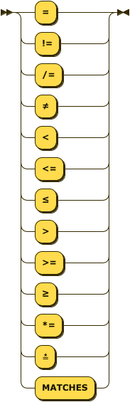

# Literals

Any valid atom is also a valid _positive relational_ literal. The syntax below also allows for _negative_ literals as well as arithmetic expressions as literals. Conjunction may be written with the Unicode character `∧` (U+2227: logical and ).



```ebnf
literal ::= ( "!" | "NOT" | "￢" )?
            ( relational-literal 
            | arithmetic-literal ) ;
```


```ebnf
relational-literal
        ::= atom ;
```

## Examples 

The following rules are all equivalent.

```datalog
ancestor(X, Y) ⟵ parent(X, Z)  ,  ancestor(Z, Y).
ancestor(X, Y) ⟵ parent(X, Z)  &  ancestor(Z, Y).
ancestor(X, Y) ⟵ parent(X, Z)  ∧  ancestor(Z, Y).
ancestor(X, Y) ⟵ parent(X, Z) AND ancestor(Z, Y).
```

## Negation

The language feature `negation` corresponds to the language $\small\text{Datalog}^{\lnot}$ and
allows the specification of negated literals. Negation may also be written using the Unicode
character `￢` (U+FFE2: full-width not sign). The following rules are equivalent.

```datalog
.pragma negation.

alive(X) :- person(X), NOT dead(X).
alive(X) ⟵ person(X) ∧ ￢dead(X).
```

The following will fail as the negated rule is not considered safe `ERR_NEGATIVE_VARIABLE_NOT_IN_POSITIVE_RELATIONAL_LITERAL`.

```datalog
.pragma negation.

alive(X) :- NOT dead(X).
alive(X) ⟵ ￢dead(X).
```

## Arithmetic Literals

The language feature `comparisons` corresponds to the language $\small\text{Datalog}^{\theta}$ and
allows the use of arithmetic literals. Comparisons take place between two literals and are
currently limited to a set of common operators. Note the addition of a string match operator, this
is similar to the Perl `=~` and requires a string value/variable on the left and a string value or
variable on the right that compiles to a valid Rust regular expression. Finally, the rule `named-term` disallows the use of anonymous variables in arithmetic literals.



```ebnf
arithmetic-literal
        ::= operand operator operand ;
```



```ebnf
operand ::= ( named-variable | constant ) ;
```



```ebnf
operator
        ::= "="
            | ("!=" | "/=" | "≠")
            | "<"
            | ("<=" | "≤")
            | ">"
            | (">=" | "≥")
            | ("*=" | "≛" | "MATCHES") ;
```

The Unicode characters `≠` (not equal to `\u{2260}`), `≤` (less-than or equal to `\u{2264}`),
`≥` (greater-than or equal to `\u{2265}`, and star equals `\u{e2899b}`) may be substituted for the
common arithmetic and string operators.

All arithmetic operations **must** be between terms of the some type, such that the property
_compatible_ introduce above is defined as:

$$\tag{xvi}\small compatible(\tau_{lhs}, \tau_{rhs}, \theta) \leftarrow \tau_{lhs} = \tau_{rhs}$$

Additionally, some operators are not present for all types, as shown in the table below.

| Type    | `=`, `≠`   | `<`, `≤`, `>`, `≥` | `≛` |
|---------| ---------- | ------------------ | --- |
| String  | Yes        | Yes - lexical      | Yes |
| Integer | Yes        | Yes                | No  |
| Decimal | Yes        | Yes                | No  |
| Float   | Yes        | Yes                | No  |
| Boolean | Yes        | No                 | No  |

## Errors

* `ERR_INCOMPATIBLE_TYPES_FOR_OPERATOR` -- the two operands have different types; for example `1 < true`.
* `ERR_INVALID_OPERATOR_FOR_TYPE` -- the operator is not supported by one, or both, operands `22 *= false`.

## Example

The following is an example using arithmetic literals and the _car_ relation.

```datalog
.pragma arithmetic_literals.
.assert car(make: string, model: string, age: integer).

antique(X, Y) :- car(X, Y, _) AND X *= "[dD]uesenberg".
antique(X, Y) :- car(X, Y, _) AND Y = "model t".
antique(X, Y) :- car(X, Y, Z) AND Z > 50.
```
