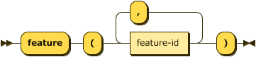
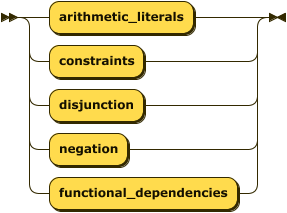

# Processing Instructions

Processing Instructions are declarative statements meant for the parser and runtime tooling, they do not affect
the meaning of the program itself.


```ebnf
processing-instruction  
      ::= "." 
          ( pi-feature 
          | pi-assert | pi-infer 
          | pi-fd 
          | pi-input | pi-output 
          | pi-pragma ) 
          "." ;
```

## Processing Instruction `feature`

The `feature` processing instruction determines which Datalog language is in use. Use of syntax not supported by the
selected language feature will result in errors.



```ebnf
pi-feature ::= "feature" "(" feature-id ( "," feature-id )* ")" ;
```



```ebnf
feature-id
        ::= "comparisons"
        | "constraints"
        | "disjunction"
        | "negation"
        | "functional_dependencies"
```

### Example

```datalog
.feature(negation).
.feature(comparisons, disjunction).
```

## Processing Instruction `assert`

The `assert` processing instruction describes a new relation in the extensional database. The parser can determine
the schema for facts from their types in the database. The use of this processing instruction is therefore optional,
but recommended.


```ebnf
pi-assert
        ::= "assert" relation-decl ;
```


```ebnf
relation-decl
        ::= predicate "(" attribute-decl ( "," attribute-decl )* ")" ;
```


```ebnf
attribute-decl
        ::= ( predicate ":" )?
            ( "boolean" | "float" | "decimal" | "integer" | "string" ) ;
```

### Example

```datalog
.assert human(name: string).
```

## Processing Instruction `infer`

The `infer` processing instruction describes a new relation in the intensional database. Typically the parser
can determine the schema for relational literals from their context, The use of this processing instruction
is therefore optional, but recommended. The alternate form is more explicit in that it defines
an intensional relation in terms of a previously defined extensional relation.


```ebnf
pi-infer
        ::= "infer" ( relation-decl | "from" predicate ) ;
```

### Example

```datalog
.infer mortal(name: string).
```

Alternatively the short-cut form is often more convenient.

```datalog
.assert human(name: string).
.infer mortal from human.
```

## Processing Instruction `fd`

The `fd` processing instruction, short for _functional dependency_, introduces a relationship between one or more attributes on the
left-hand (determinant) side and one or more attributes on the right-hand (dependent) side. This relationship denotes
that for a relationship $\small R$ with attributes $\small a_1, \cdots, a_n$, every valid combination of determinant
values uniquely determines the value of the dependent values.

Note that this processing instruction is only valid if the corresponding language feature is enabled.


```ebnf
pi-fd      ::= ( "fd" | "functional_dependency" ) 
            predicate ":"
            attribute-index-list ( "-->" | "⟶" ) attribute-index-list
``` 


```ebnf
attribute-index-list
        ::= attribute-index ( "," attribute-index )*
```

An attribute index is _either_ an attribute label, if one has been declared for the relation, or an integer $\small i \in \[1,|schema\(R\)|\]$.


```ebnf
attribute-index
        ::= integer | predicate
``` 

**Constraints** -- given the notational form $\small R: \alpha \rightarrow \Beta$;

1. the initial predicate **must** be the label of an extensional relation:
   $$\small R \in D_I \land label\(R\)$$
2. the set of attribute identifiers comprising the set $\small \alpha$ **must** be in $\small R$:
   $$\small \forall a \in \alpha \(a \in schema\(R\)\)$$
3. the set of attribute identifiers comprising the set $\small \Beta$ **must** be in $\small R$:
   $$\small \forall a \in \Beta \(a \in schema\(R\)\)$$
4. the same attribute identifier **must not** appear in both determinant and dependent:
   $$\small \alpha \cap \Beta = \emptyset$$

### Example

Given the extensional relation _employee_ the two functional dependencies in the
following are equivalent. Note that the implementation will ignore such duplicate declarations.

```datalog
.feature(functional_dependencies).
.assert employee(id:integer, name:string).

.fd employee: id --> name.
.fd employee: 1 ⟶ 2.
```

## Processing Instruction `input`

The `input` processing instruction instructs the parser to load facts for the named extensional relation from an
external file. This processing instruction **requires** that the relation be previously defined via the `assert`
processing instruction.


```ebnf
pi-input   ::= "input" io-details "."
```


```ebnf
io-details
        ::= "(" predicate "," quoted-string
                ( "," format-spec )?
            ")" ;
```


```ebnf
format-spec
        ::= quoted-string ( "," assign-list )? ;
```


```ebnf
assign-list
        ::= assignment ( "," assignment )* ;
```


```ebnf
assignment
        ::= predicate "=" constant ;
```

the first quoted string is the type and 

For a detailed discussion of media type handling, see [Dataset Processing](resolvers.md#media-types).

### Example

```datalog
.assert human(name: string).
.input(human, "data/humans.csv", "csv").
```

## Processing Instruction `output`

The `output` processing instruction instructs the parser to write facts from the named intensional relation to an
external file. This processing instruction **requires** that the relation be previously defined via the `infer`
processing instruction.


```ebnf
pi-output  ::= "output" io-details "." ;
```

### Example

```datalog
.infer mortal(name: string).
.output(mortal, "data/mortals.txt").
```

```datalog
.infer mortal(name: string).
.output(mortal, "data/mortals.txt", "csv", separator=";", header=present).
```

## Processing Instruction `pragma`


```ebnf
pi-pragma
        ::= "pragma" predicate ( "(" assignment-list ")" )? ;
```

### Defined Pragmas and Keys

| Pragma | Key | Value Type | Description                                                                      |
|--------|-----|------------|----------------------------------------------------------------------------------|
| base   | iri | string     | Interpreted as an absolute IRI, all other references are relative to this value. |

**Notes**

1. If the `base` pragma is not specified then any references in the subject resource are relative to the resource location if known by the parser, or relative to the process performing the parsing.

### Example

In the following case the base IRI is _implicit_ and is determined by the parser to dereference the relative value "data/humans.csv".

```datalog
.assert human(string).
.input(human, "data/humans.csv", "csv").
```

In the following case the base IRI is _explicitly_ declared and so the input for `human` is clearly "https://example.com/datalog/data/humans.csv".

```datalog
.pragma base(iri="https://example.com/datalog/").
.assert human(string).
.input(human, "data/humans.csv", "csv").
```
