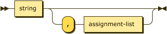

# Processing Instructions

Processing Instructions are declarative statements that allow the parser and processor to enable and disable language features as well as load and save external relation data. 

A conformant DATALOG-TEXT processor MUST signal the error `ERR_UNSUPPORTED_PROCESSING_INSTRUCTION` when detecting a processing instruction identifier which they do not recognize or cannot support, even if it may be valid in some other version of this specification.


```ebnf
processing-instruction  
      ::= "." 
          ( pi-pragma 
          | pi-assert | pi-infer 
          | pi-fd 
          | pi-input | pi-output ) 
          "." ;
```

## Strict Processing

When strict processing is enabled (either by pragma or command-line) the following processing instructions MUST BE used:

1. feature pragmas -- all features required MUST BE declared before use.
2. `assert` -- all extensional relations MUST BE declared before use.
2. `infer` -- all intensional relations MUST BE declared before use.

## Processing Instruction `pragma`

A pragma is generally used to enable or disable some feature of either the parser or resolver. The first `predicate` in this production is termed the _pragma identifier_. The details of supported pragmas is in the separate section [§ Pragmas](pragmas.md).

A conformant DATALOG-TEXT processor MUST signal an error when detecting a pragma identifier which they do not recognize, even if it may be valid in some other version of this specification.


```ebnf
pi-pragma
        ::= "pragma" predicate ( "=" constant )? ;
```

## Processing Instruction `assert`

The `assert` processing instruction declares a new relation in the extensional database. 

The following constraints exist:

1. the initial predicate MUST NOT be the label of an existing relation.
1. all attribute labels, if declared, MUST BE distinct.

All extensional relations MUST be asserted before use in strict processing mode, an error MUST BE signaled otherwise. In non-strict mode a conforming DATALOG-TEXT processor MAY signal an error, or MAY continue processing as if the feature is enabled and infer the declaration and attribute types when the first fact is parsed. The use of this processing instruction is therefore optional, but recommended.


```ebnf
pi-assert
        ::= "assert" relation-decl ;
```

A relation declaration declares the types, and optionally the names, of the attributes of a relation. The first predicate in `relation-decl` is the label of the relation, the attributes themselves are defined within the following parenthesis.


```ebnf
relation-decl
        ::= predicate "(" attribute-decl ( "," attribute-decl )* ")" ;
```

Each attribute has a declared type, and may also be preceded by a predicate label.


```ebnf
attribute-decl
        ::= ( predicate ":" )?
            ( "boolean" | "float" | "decimal" | "integer" | "string" ) ;
```

Note that the types `float` and `decimal` are only available if the feature `extended_numerics` is enabled.

### Example

The following declares a relation labeled `human` that has a single string attribute.

```datalog
.assert human(string).
```

The following declares a relation labeled `human` that has a single string attribute, labeled as `name`.

```datalog
.assert human(name: string).
```

## Processing Instruction `infer`

In the same manner as `assert` above, the `infer` processing instruction declares a new relation in the intensional database. The alternate form is even more explicit in that it declares an intensional relation in terms of a previously declared extensional relation. 

The following constraints exist:

1. the initial predicate MUST NOT be the label of an existing relation.
1. all attribute labels, if declared, MUST BE distinct.

All intensional relations MUST be asserted before use in strict processing mode, an error MUST BE signaled otherwise. In non-strict mode a conforming DATALOG-TEXT processor MAY signal an error, or MAY continue processing as if the feature is enabled and infer the declaration and attribute types from rules as they are parsed. The use of this processing instruction is therefore optional, but recommended.


```ebnf
pi-infer
        ::= "infer" ( relation-decl | "from" predicate ) ;
```

### Example

The following declares a relation labeled `mortal` that has a single string attribute, labeled as `name`.

```datalog
.infer mortal(name: string).
```

Alternatively the short-cut form is often more convenient but has the advantage that if the definition of `human` changes declaration changes accordingly.

```datalog
.assert human(name: string).
.infer mortal from human.
```

## Processing Instruction `fd`

The `fd` processing instruction, short for _functional dependency_, introduces a relationship between one or more attributes on the left-hand side (determinant -- a set denoted by $\small\alpha$) and one or more attributes on the right-hand side (dependent -- a set denoted by $\small\beta$). This relationship denotes that for a relationship $\small R$, every valid combination of determinant values uniquely determines the value of the dependent values. The syntax for the dependency is intended to be as close to the mathematical form $\small R: \alpha \longrightarrow \beta$. 

The following constraints exist:

1. the initial predicate MUST BE the label of an extensional relation.
2. the set of attribute identifiers comprising the set $\small\alpha$ MUST BE in $\small R$.
3. the set of attribute identifiers comprising the set $\small\beta$ MUST BE in $\small R$.
4. the same attribute identifier MUST NOT appear in both determinant and dependent.

In strict processing mode this processing instruction is only valid if the corresponding language feature is enabled, an error MUST BE signaled otherwise. non-strict mode a conforming DATALOG-TEXT processor MAY signal an error, or MAY continue processing as if the feature is enabled. 

Duplicate functional dependencies MUST NOT be treated as an error; however, a DATALOG-TEXT processor MAY issue a warning on detection of duplicate values.


```ebnf
pi-fd      ::= ( "fd" | "functional_dependency" ) 
            predicate ":"
            attribute-index-list ( "-->" | "⟶" ) attribute-index-list
```


```ebnf
attribute-index-list
        ::= attribute-index ( "," attribute-index )*
```

An attribute index is _either_ an attribute label, if one has been declared for the relation, or an integer $\small i \in \[1,|schema\(R\)|\]$.


```ebnf
attribute-index
        ::= integer | predicate
``` 

### Examples

Given the extensional relation _employee_ the two functional dependencies in the
following are equivalent. Note that the implementation will ignore such duplicate declarations.

```datalog
.feature(functional_dependencies).
.assert employee(id:integer, name:string).

.fd employee: id --> name.
.fd employee: 1 ⟶ 2.
```

## Processing Instruction `input`

The `input` processing instruction instructs the parser to load facts for the named extensional relation from an external file. 

> This specification does not determine whether loading external resources happens during parsing, at the completion of parsing, at evaluation time, or via a client initiated API call. However, as some errors (fact schema conformance for example) cannot happen until facts are loaded, this choice MAY defer the signaling of some critical errors.


```ebnf
pi-input   ::= "input" io-details
```


The `io-details` production informs the parser of the expected media type for the external resource and any parameters for that media type.  

The following constraints exist:

1. the initial predicate in MUST BE the label of an extensional relation.
2. the first `quoted-string` in the following production is interpreted as a URI <span class="bibref inline">[RFC3986](x_references.md#RFC3986)</span> which MUST BE handled as per [§ Resolvers](resolvers.md).

For a detailed discussion of media type handling, see [§ Dataset Processing](resolvers.md#media-types).

```ebnf
io-details
        ::= "(" predicate "," quoted-string
                ( "," format-spec )?
            ")" ;
```

A format specifier provides information that allows a resolver to identify the type of resource that will be fetched and informs the parser how to interpret the fetched resource.

The following constraints exist:

1. the initial string value MUST BE either the type name and subtype name of a supported media type (i.e. `text/csv`) or one of the supported media type short form identifiers described in Resolvers [§ Media Types](resolvers.md#media-types).



```ebnf
format-spec
        ::= string ( "," assign-list )? ;
```

The assignment list provides the parameters that may be required for a particular media type. For example, the media type `text/csv` supports two optional parameters, `charset` and `header`; the value of the header parameter MUST BE one of `present` or `absent` <span class="bibref inline">[RFC4180](x_references.md#RFC4180)</span>, section 3.


```ebnf
assignment-list
        ::= assignment ( "," assignment )* ;
```

In the following production an assignment allows a form where no right-hand side is specified. This is only legal if the value denoted by the `predicate` is a boolean parameter and used in this way denotes `=true`. Therefore, `(escaped=true)` is equivalent to `(escaped)`.


```ebnf
assignment
        ::= predicate ( "=" constant )? ;
```

### Examples

In the following example the full media type is used and a parameter, allowing the resolver to pass the following request header to an HTTP request
`Accept: text/csv;header=absent`

```datalog
.assert human(name: string).
.input(human, "data/humans.csv", "text/csv", header=absent).
```

In the following the short form of the media type is used, allowing the resolver to pass the following request header to an HTTP request
`Accept: text/csv`

```datalog
.assert human(name: string).
.input(human, "data/humans.csv", "csv").
```

In the following no media type is present, in this case the resolver MUST follow the steps in [§ Resolvers](resolvers.md).

```datalog
.assert human(name: string).
.input(human, "data/humans.csv").
```

## Processing Instruction `output`

The `output` processing instruction instructs the parser to write facts from the named intensional relation to an external file. 

> This specification does not determine whether writing to external resources happens during evaluation, at completion of evaluation, or via a client initiated API call. However, as some errors (un-writable output resource) cannot happen until intensional relations are stored, this choice MAY defer the signaling of some critical errors.


```ebnf
pi-output  ::= "output" io-details "." ;
```

### Examples

```datalog
.infer mortal(name: string).
.output(mortal, "data/mortals.txt").
```

```datalog
.infer mortal(name: string).
.output(mortal, "data/mortals.txt", "csv", separator=";", header=present).
```
