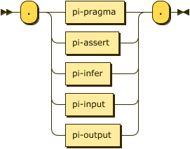

# Processing Instructions

Processing Instructions are declarative statements that allow the parser and processor to enable and disable language features as well as load and save external relation data. 

A conformant DATALOG-TEXT processor MUST signal the error [`ERR_UNSUPPORTED_PROCESSING_INSTRUCTION`](errors.md#ERR_UNSUPPORTED_PROCESSING_INSTRUCTION) when detecting a processing instruction identifier which they do not recognize or cannot support, even if it may be valid in some other version of this specification.



```ebnf
processing-instruction  
      ::= "." 
          ( pi-pragma 
          | pi-assert | pi-infer 
          | pi-input | pi-output ) 
          "." ;
```

## Strict Processing

When strict processing is enabled (either by pragma or command-line) the following processing instructions MUST BE used:

1. feature pragmas -- all features required MUST BE declared before use.
2. `assert` -- all extensional relations MUST BE declared before use.
2. `infer` -- all intensional relations MUST BE declared before use.

## Processing Instruction `pragma`

A pragma is generally used to enable or disable some feature of either the parser or resolver. The first `predicate` in this production is termed the _pragma identifier_. The details of supported pragmas is in the separate section [§&nbsp;Pragmas](pragmas.md).

A conformant DATALOG-TEXT processor MUST signal an error when detecting a pragma identifier which they do not recognize, even if it may be valid in some other version of this specification.


```ebnf
pi-pragma
        ::= "pragma" predicate ( "=" constant )? ;
```

### Errors

* [`ERR_UNSUPPORTED_PRAGMA`](errors.md#ERR_UNSUPPORTED_PRAGMA) -- the initial predicate does not identify a supported pragma.

## Processing Instruction `assert`

The `assert` processing instruction declares a new relation in the extensional database. 

The following constraints exist:

1. the initial predicate MUST NOT be the label of an existing relation.
1. all attribute labels, if declared, MUST BE distinct.

All extensional relations MUST be asserted before use in strict processing mode, an error MUST BE signaled otherwise. In non-strict mode a conforming DATALOG-TEXT processor MAY signal an error, or MAY continue processing as if the feature is enabled and infer the declaration and attribute types when the first fact is parsed. The use of this processing instruction is therefore optional, but recommended.


```ebnf
pi-assert
        ::= "assert" relation-decl functional-dependency-list? ;
```

A relation declaration declares the types, and optionally the names, of the
attributes of a relation. The first predicate in `relation-decl` is the label
of the relation, the attributes themselves are defined within the following
parenthesis:


```ebnf
relation-decl
        ::= predicate attribute-decl-list ;
```

Each attribute has a declared type, and may also be preceded by a predicate label.


```ebnf
attribute-decl-list
        ::= "(" attribute-decl ( "," attribute-decl )* ")" ;
```


```ebnf
attribute-decl
        ::= ( predicate ":" )?
            ( "boolean" | "float" | "decimal" | "integer" | "string" ) ;
```

Note that the types `float` and `decimal` are only available if the feature `extended_numerics` is enabled.

### Errors

* [`ERR_INVALID_RELATION`](errors.md#ERR_INVALID_RELATION) -- the values for production `attribute-decl-list` where invalid, it was not possible to construct a compliant relation schema.
* [`ERR_RELATION_ALREADY_EXISTS`](errors.md#ERR_RELATION_ALREADY_EXISTS) -- the predicate labeling the relation already exists (either as an extensional or intensional relation).

### Example

The following declares a relation labeled `human` that has a single string attribute:

```datalog
.assert human(string).
```

The following declares a relation labeled `human` that has a single string attribute, labeled as `name`:

```datalog
.assert human(name: string).
```

The following is an error in that the `name` label is used for two separate attributes:

```datalog
.assert human(name: string, name: string).
%% ==> ERR_INVALID_RELATION
```

The following is an error, relations cannot be defined twice:

```datalog
.assert human(name: string).
.assert human(first_name: string, last_name: string).
%% ==> ERR_RELATION_ALREADY_EXISTS
```

### Functional Dependencies

The `functional-dependency-list` production introduces a relationship between one or more attributes on the left-hand side (determinant -- a set denoted by $\small\alpha$) and one or more attributes on the right-hand side (dependent -- a set denoted by $\small\beta$). This relationship denotes that for a relationship $\small R$, every valid combination of determinant values uniquely determines the value of the dependent values. The syntax for the dependency is intended to be as close to the mathematical form $\small R: \alpha \longrightarrow \beta$.

The following constraints exist:

2. the set of attribute identifiers comprising the set $\small\alpha$ MUST BE in $\small R$.
3. the set of attribute identifiers comprising the set $\small\beta$ MUST BE in $\small R$.
4. the same attribute identifier MUST NOT appear in both determinant and dependent.

In strict processing mode this production is only valid if the corresponding language feature is enabled, an error MUST BE signaled otherwise. non-strict mode a conforming DATALOG-TEXT processor MAY signal an error, or MAY continue processing as if the feature is enabled.

Duplicate functional dependencies MUST NOT be treated as an error, they can be ignored; however, a DATALOG-TEXT processor MAY issue a warning on detection of duplicate values.


```ebnf
functional-dependency-list
        ::= ":" functional-dependency ( ";" functional-dependency )* ;
```


```ebnf
functional-dependency
        ::= attribute-index-list ( "-->" | "⟶" ) attribute-index-list ;
```


```ebnf
attribute-index-list
        ::= attribute-index ( "," attribute-index )*
```

An attribute index is _either_ an attribute label, if one has been declared for the relation, or an integer $\small i \in \[1,|schema\(R\)|\]$.


```ebnf
attribute-index
        ::= integer | predicate
``` 


#### Errors

* [`ERR_INVALID_ATTRIBUTE_INDEX`](errors.md#ERR_INVALID_ATTRIBUTE_INDEX) --
  the index (integer) is not valid within the relation's schema. 
* [`ERR_INVALID_ATTRIBUTE_LABEL`](errors.md#ERR_INVALID_ATTRIBUTE_LABEL) --
  the label (predicate) is not valid within the relation's schema. 

#### Examples

Given the extensional relation _employee_ the two functional dependencies in the
following are equivalent. Note that the implementation will ignore such duplicate declarations.

```datalog
.feature(functional_dependencies).

.assert employee(id:integer, name:string) : id --> name.
.assert employee(id:integer, name:string) : 1 ⟶ 2.
```

The following errors result from invalid attributes specified in the dependency.

```datalog
.feature(functional_dependencies).

.assert employee(id:integer, name:string) : 1 ⟶ 42.
%% ==> ERR_INVALID_ATTRIBUTE_INDEX
.assert employee(id:integer, name:string) : id --> first_name.
%% ==> ERR_INVALID_ATTRIBUTE_LABEL
```

## Processing Instruction `infer`

In the same manner as `assert` above, the `infer` processing instruction declares a new relation in the intensional database. The alternate form is even more explicit in that it declares an intensional relation in terms of a previously declared extensional relation. 

The following constraints exist:

1. the initial predicate MUST NOT be the label of an existing extensional relation.
1. all attribute labels, if declared, MUST BE distinct.

All intensional relations MUST be asserted before use in strict processing mode, an error MUST BE signaled otherwise. In non-strict mode a conforming DATALOG-TEXT processor MAY signal an error, or MAY continue processing as if the feature is enabled and infer the declaration and attribute types from rules as they are parsed. The use of this processing instruction is therefore optional, but recommended.


```ebnf
pi-infer
        ::= "infer" ( relation-decl | "from" predicate ) ;
```

### Errors

* [`ERR_INVALID_RELATION`](errors.md#ERR_INVALID_RELATION) -- the values for
  production `attribute-decl-list` where invalid, it was not possible to
  construct a compliant relation schema. 
* [`ERR_RELATION_ALREADY_EXISTS`](errors.md#ERR_RELATION_ALREADY_EXISTS) --
  the predicate labeling the relation already exists (either as an extensional
  or intensional relation). 
* [`ERR_PREDICATE_NOT_AN_EXTENSIONAL_RELATION`](errors.md#ERR_PREDICATE_NOT_AN_EXTENSIONAL_RELATION)
  -- the predicate following the `from` keyword is not the label of an
  extensional relation. 

### Example

The following declares a relation labeled `mortal` that has a single string attribute, labeled as `name`.

```datalog
.infer mortal(name: string).
```

Alternatively the short-cut form is often more convenient but has the advantage that if the definition of `human` changes declaration changes accordingly.

```datalog
.assert human(name: string).
.infer mortal from human.
```

The following error is raised as `humans` is incorrectly spelled.

```datalog
.assert human(name: string).
.infer mortal from humans.
%% ==> ERR_PREDICATE_NOT_AN_EXTENSIONAL_RELATION
```

## Processing Instruction `input`

The `input` processing instruction instructs the parser to load facts for the named extensional relation from an external file. 

> This specification does not determine whether loading external resources happens during parsing, at the completion of parsing, at evaluation time, or via a client initiated API call. However, as some errors (fact schema conformance for example) cannot happen until facts are loaded, this choice MAY defer the signaling of some critical errors.


```ebnf
pi-input
        ::= "input" io-details ;
```

The `io-details` production informs the parser of the expected media type for the external resource and any parameters for that media type.
The initial predicate in MUST BE the label of an extensional relation.

For a detailed discussion of media type handling, see [§&nbsp;Dataset Media Types](resolvers.md#dataset-media-types).


```ebnf
io-details
        ::= predicate parameter-list ;
```

The parameter list provides the values that are specified for a particular media type. For example, the media type `text/csv` supports two optional parameters, `charset` and `header`; the value of the header parameter MUST BE one of `present` or `absent` <span class="bibref inline">[RFC4180](x_references.md#RFC4180)</span>, section 3.


```ebnf
parameter-list
        ::= parameter-assignment ( "," parameter-assignment )* ;
```


```ebnf
parameter-assignment
        ::= predicate "=" constant ;
```

### Errors

* [`ERR_PREDICATE_NOT_AN_EXTENSIONAL_RELATION`](errors.md#ERR_PREDICATE_NOT_AN_EXTENSIONAL_RELATION)
  -- the predicate is not the label of an extensional relation, the `input`
  processing instruction is only valid for extensional relations.
* [`ERR_INVALID_URI`](errors.md#ERR_INVALID_URI) -- the `uri` parameter could
  not be parsed, or has an unsupported scheme.
* [`ERR_UNSUPPORTED_MEDIA_TYPE`](errors.md#ERR_UNSUPPORTED_MEDIA_TYPE) -- the
  `type` parameter could not be parsed, or has an unsupported media type. 
* [`ERR_IO_INSTRUCTION_PARAMETER`](errors.md#ERR_IO_INSTRUCTION_PARAMETER) --
  another parameter provided for the type was either missing or has an
  incorrect value. 
* [`ERR_INPUT_RESOURCE_DOES_NOT_EXIST`](errors.md#ERR_INPUT_RESOURCE_DOES_NOT_EXIST)
  -- the URI could not be resolved to an accessible resource. 
* [`ERR_IO_SYSTEM_FAILURE`](errors.md#ERR_IO_SYSTEM_FAILURE) -- some other I/O
  failure occurred. 
 
### Examples

In the following example the full media type is used and a parameter, allowing the resolver to pass the following request header to an HTTP request
`Accept: text/csv;header=absent`

```datalog
.assert human(name: string).
.input(human, uri="data/humans.csv", type="text/csv", header=absent).
```

In the following the short form of the media type is used, allowing the resolver to pass the following request header to an HTTP request
`Accept: text/csv`

```datalog
.assert human(name: string).
.input(human, uri="data/humans.csv", type="csv").
```

In the following no media type is present, in this case the resolver MUST follow the steps in [§&nbsp;Resolvers](resolvers.md).

```datalog
.assert human(name: string).
.input(human, uri="data/humans.csv").
```

The following error is signaled due to the media type `audio/mp4` which is not, and is unlikely to ever be, supported.

```datalog
.assert human(name: string).
.input(human, uri="data/humans.csv", type="audio/mp4").
%% ==> ERR_UNSUPPORTED_MEDIA_TYPE
```

The values for the `header` parameter are `absent` or `present`.

```datalog
.assert human(name: string).
.input(human, uri="data/humans.csv", headers=yes_please).
%% ==> ERR_IO_INSTRUCTION_PARAMETER
```

## Processing Instruction `output`

The `output` processing instruction instructs the parser to write facts from the named intensional relation to an external file. 

This specification does not determine whether writing to external resources happens during evaluation, at completion of evaluation, or via a client initiated API call. However, as some errors (un-writable output resource) cannot happen until intensional relations are stored, this choice MAY defer the signaling of some critical errors.


```ebnf
pi-output  ::= "output" io-details "." ;
```

### Errors

* [`ERR_PREDICATE_NOT_AN_INTENSIONAL_RELATION`](errors.md#ERR_PREDICATE_NOT_AN_INTENSIONAL_RELATION)
  -- the predicate is not the label of an intensional relation, the `output`
  processing instruction is only valid for intensional relations.
* [`ERR_INVALID_URI`](errors.md#ERR_INVALID_URI) -- the `uri` parameter could
  not be parsed, or has an unsupported scheme.
* [`ERR_UNSUPPORTED_MEDIA_TYPE`](errors.md#ERR_UNSUPPORTED_MEDIA_TYPE) -- the
  `type` parameter could not be parsed, or has an unsupported media type.
* [`ERR_IO_INSTRUCTION_PARAMETER`](errors.md#ERR_IO_INSTRUCTION_PARAMETER) --
  another parameter provided for the type was either missing or has an
  incorrect value.
* [`ERR_OUTPUT_RESOURCE_NOT_WRITEABLE`](errors.md#ERR_OUTPUT_RESOURCE_NOT_WRITEABLE)
  -- the URI identified a resource that could not be written to.
* [`ERR_IO_SYSTEM_FAILURE`](errors.md#ERR_IO_SYSTEM_FAILURE) -- some other I/O
  failure occurred.

### Examples

```datalog
.infer mortal(name: string).
.output(mortal, uri="data/mortals.txt").
```

```datalog
.infer mortal(name: string).
.output(mortal, uri="data/mortals.txt", type="csv", separator=";", header=present).
```
