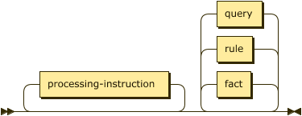

# Program

A Datalog program consists of a set of facts that comprise the extensional database, a list of rules that are used to infer relations in the intensional database, and possibly a set of queries to interrogate the result of any reasoning performed over the program.

To be able to facilitate interchange a DATALOG-TEXT resource also includes
_processing instructions_ that provide the parser and resolver information on
how to interpret the contents of the resource[^1].



```ebnf
program ::= processing-instruction* ( fact | rule | query )* ;
```

A program consists of a single file containing facts, rules, and queries as well as any additional files referenced via [§&nbsp;Processing Instructions](grammar_pi.md).

## Example

The following program is an encoding of the classical syllogism "_all men are mortal, Socrates is a man, therefore Socrates is mortal_" <span class="bibref inline">[Mill1851](x_references.md#Mill1851)</span>.

```datalog
1: .assert human(string).
2: .infer mortal from human.
3: 
4: human(socrates).
5: 
6: mortal(X) :- human(X).
7: 
8: ?- mortal(socrates).
```

* Lines 1-2 define two relations, an extensional relation named _human_ and an intensional relation named _mortal_. Each relation schema comprises a single, unlabeled, string attribute.
* Line 4 makes the assertion that Socrates is human.
* Line 6 is the rule that any human is also therefore mortal.
* Line 8 is a query that effectively asks _is there a fact in the mortal relation where the attribute is "socrates"?_.

The outcome of this will be of the form:

```text
+------------+
| _: boolean |
+============+
| true       |
+------------+
```

<p>&nbsp;</p>

-----

[^1]: Syntax diagrams are generated by [bottlecaps.de](https://www.bottlecaps.de/rr/ui).
