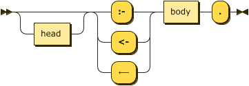
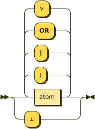

# Rules

As [§&nbsp;Facts](grammar_facts.md) are syntactically distinct from rules in DATALOG-TEXT  there is no need for empty bodies -- all rules MUST have at least one literal. Material implication may be written using the Unicode character `⟵` (U+27F5: long leftwards arrow).



```ebnf
rule    ::= head? ( ":-" | "<-" | "⟵" ) body "." ;
```

The following sets of rules are equivalent.

```datalog
ancestor(X, Y) :- parent(X, Y).
ancestor(X, Y) <- parent(X, Y).
ancestor(X, Y) ⟵ parent(X, Y).
```

## Rule Head

The head of a rule MUST conform to one of the following:

* In the language $\small\text{Datalog}$ a single [§&nbsp;Atom](grammar_atoms.md).
* In the language $\small\text{Datalog}^{\lor}$ a disjunction of one or more [§&nbsp;Atom](grammar_atoms.md).
* In the language $\small\text{Datalog}^{\Leftarrow}$ nothing, or syntactically the value `"⊥"`.



```ebnf
head    ::= ( atom ( ( ";" | "|" | "OR" | "∨" ) atom )* )
            | "⊥" ;
```

A processor MUST signal the error `ERR_EXTENSIONAL_RELATION_IN_RULE_HEAD` (in [§&nbsp;Errors](errors.md)) when it detects  an extensional relation used in the head of a rule. 

```datalog
parent("Xerces", brooke).

parent(X,Y) :- father(X,Y).
%% ==> ERR_EXTENSIONAL_RELATION_IN_RULE_HEAD
```

### Disjunction

The language feature `disjunction` (enabled by the [§&nbsp;Pragma disjunction](pragmas.md#pragma-disjunction-feature)) corresponds to the language $\small\text{Datalog}^{\lor}$ and allows multiple atoms to appear in the rule's head with the semantics that these are choices. This syntax will not be accepted unless the feature is enabled.

The following describes the rule that _if X is a parent then X is **either** a father **or** mother_.

```datalog
.pragma disjunction.

father(X) ;  mother(X) :- parent(X).
father(X) |  mother(X) :- parent(X).
father(X) OR mother(X) :- parent(X).
father(X) ⋁  mother(X) :- parent(X).
```

As the use of disjunction in this position in the head is _inclusive_ it is considered that any rule as above can be transformed into the following standard form. Clearly, in this case this is not the expected semantics which would require an _exclusive disjunction_, the language $\small\text{Datalog}^{\oplus}$. This specification does not support exclusive disjunction.

```datalog
father(X) :- parent(X).
mother(X) :- parent(X).
```

### Constraints

The language feature `constraints` (enabled by the [§&nbsp;Pragma constraints](pragmas.md#pragma-constraints-feature)) corresponds to the language $\small\text{Datalog}^{\Leftarrow}$ and allows the specification of rules with no head. In this case the material implication symbol is REQUIRED, the falsity symbol MAY be used for readability.

The following sets of rules are equivalent.

```datalog
.pragma constraints.

:- alive(X) AND dead(X).
⊥ ⟵ alive(X) ∧ dead(X).
```

## Rule Body

The body of a rule is a conjunction of one, or more, [§&nbsp;Literals](grammar_literals.md).


```ebnf
body    ::= literal ( ( "," | "&" | "AND" | "∧" ) literal )* ;
```

The following sets of rules are equivalent.

```datalog
movie_star(X) :- star(X)  ,  movie_cast_member(X, _, _).
movie_star(X) :- star(X)  &  movie_cast_member(X, _, _).
movie_star(X) :- star(X) AND movie_cast_member(X, _, _).
movie_star(X) :- star(X)  ∧  movie_cast_member(X, _, _).
```

## Safety

A DATALOG-TEXT processor MUST disallow the creation or addition of rules that are _unsafe_. These are rule forms that typically introduce infinite sets that cannot be reasoned over.

All variables used in the head of a rule MUST appear in a positive relational literal.

```datalog
...
a(X) :- b(Y).
%% ==> ERR_HEAD_VARIABLE_NOT_IN_POSITIVE_RELATIONAL_LITERAL
```

All variables used in a negated literal MUST appear in a positive relational literal.

```datalog
.pragma negation.
...
a(X) :- b(Y), NOT b(X).
%% ==> ERR_NEGATIVE_VARIABLE_NOT_IN_POSITIVE_RELATIONAL_LITERAL
```

All variables used in an arithmetic literal MUST appear in a positive relational literal.

```datalog
.pragma arithmetic_literals.
...
a(X) :- b(Y), X < Y.
%% ==> ERR_ARITHMETIC_VARIABLE_NOT_IN_POSITIVE_RELATIONAL_LITERAL
```
