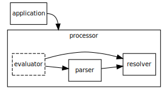

# Introduction

## How to Read This Document

_This section is non-normative._

This document is a detailed specification for DATALOG-TEXT, a representation in textual form, of a Datalog program. The document is primarily intended for the following audiences:

* Software developers who want to generate or consume Datalog programs, in a DATALOG-TEXT syntax
* Software developers who want to convert existing Datalog serializations to DATALOG-TEXT
* Software developers who want to implement processors and APIs for DATALOG-TEXT
* Software developers who want to understand the design decisions and language syntax for DATALOG-TEXT

## Contributing

_This section is non-normative._

The content for this site is generated from a [GitHub repository](https://github.com/johnstonskj/datalog-specs). Discussions, comments, and errata are hosted on the specification GitHub repository's [discussion section](https://github.com/johnstonskj/datalog-specs/discussions).

## Terminology

_This section is non-normative._

* **Media Type** -- This specification describes an Internet Media Type [RFC1590](x_references.md#RFC1590) that is used "_in order to provide open and extensible data typing and type negotiation_" -- from [RFC2616](x_references.md#RFC2616), section 3.7.
* **Program** -- A complete Datalog entity that may be serialized into a resource in a particular representation.
* **Representation** -- "_An entity included with a response that is subject to content negotiation, as described in section [removed]. There may exist multiple representations associated with a particular response status._" -- from [RFC2616](x_references.md#RFC2616), section 1.3.
* **Resource** -- "_A network data object or service that can be identified by a URI, as defined in section [removed]. Resources may be available in multiple representations (e.g. multiple languages, data formats, size, and resolutions) or vary in other ways._" -- from [RFC2616](x_references.md#RFC2616), section 1.3.

Using these terms this specification describes a particular _representation_ of a Datalog _program_, whose type is identified by a unique _media type_, that may be serialized into a _resource_ for storage or transfer.

* **Application** -- This denotes some software component that requires the ability to download, read, and act upon Datalog resources. To accomplish this the application has to interact with the _processor_.
* **Processor** -- A software component that provides at lease the _parser_ and _resolver_ and commonly the _evaluator_ as well.
  * **Parser** -- The subcomponent that actually parses the resource, validating syntax and well-formedness rules.
  * **Resolver** -- The subcomponent that has to resolve and make available any referenced external resources.
  * **Evaluator** -- The subcomponent that consumes the parsed program and entails intensional facts from rules. 

Using these terms this specification describes the requirements of the _parser_ to correctly produce some representation of the program provided to it, and also the _resolver_ requirements for retrieving external resources. 

## Datalog Naming Convention

When we talk specifically about the Datalog language it is common to represent it in a roman serif face as
$\small\text{Datalog}$. This allows the distinction of talking in general about Datalog in the abstract vs. the actual
semantics of the language $\small\text{Datalog}$.

This core $\small\text{Datalog}$ language has many documented extensions that provide additional flexibility, conciseness, or
expressiveness. These _languages_, _sub-languages_, _extensions_, or _dialects_ are usually labeled by adding a superscript
symbol that identifies the specific extension. For example, $\small\text{Datalog}^{\lnot}$ is
the language extended with negation of literals, $\small\text{Datalog}^{\Gamma}$ is the language
extended with type checking on attributes, and $\small\text{Datalog}^{\lnot,\theta}$ is the language
extended with negation of literals _and_ arithmetic literals. The order of superscript symbols is
irrelevant.

| Language                             | Introduces                                   | Symbols                                                    |
|--------------------------------------|----------------------------------------------|------------------------------------------------------------|
| $\small\text{Datalog}^{\lnot}$       | negation of literals in rule bodies          | `!`, `NOT`, `￢`                                            |
| $\small\text{Datalog}^{\lor}$        | disjunction in rule heads                    | `;`, `OR`, `∨`                                             |
| $\small\text{Datalog}^{\Leftarrow}$  | rules as constraints, i.e. no body           | N/A                                                        |
| $\small\text{Datalog}^{\Gamma}$      | typed attributes for relations               | N/A                                                        |
| $\small\text{Datalog}^{\theta}$      | arithmetic literals in rule bodies           | `=`, `!=`, `≠`, <`, `<=`, `≤`, `>`, `>=`, `≥`, `*=`, `≛`   |
| $\small\text{Datalog}^{\rightarrow}$ | functional dependency processing instruction | `-->`, `⟶`                                                 |

When referring to the specifics of the language we will use the common format $\small\text{Datalog}$ with
superscripts as necessary to identify specific language extensions being used.  
